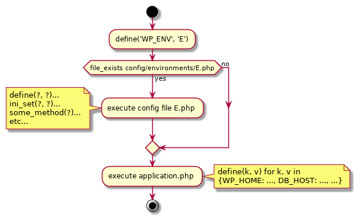
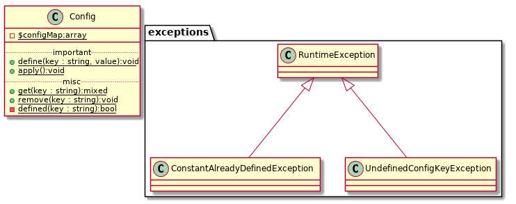
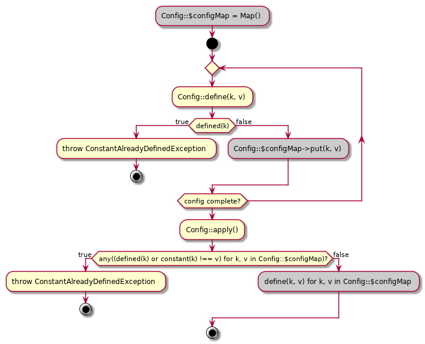
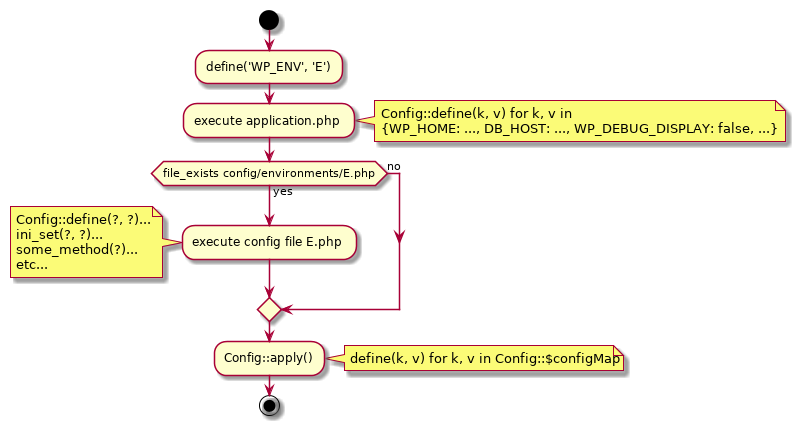

# Why wp-config?

## Problem

The previous Bedrock configuration system did not strictly adhere to one of the most important Roots core values: 

> All environments should match production as close as possible.

Stated another way and scoped specifically for Bedrock:

> Environment configuration values should default to production values and only
> deviate if absolutely necessary.

This is not how bedrock worked. [the current bedrock configuration process][brconfigcode] described by [the docs][brconfigdocs] in general worked like so:



Which seems fine at first. However, upon further examination it falls apart.

[The docs][brconfigdocs] describe this intended usage:

> The environment configs are required **before** the main `application` config so anything in an environment config takes precedence over `application`.
> 
> Note: You can't re-define constants in PHP. So if you have a base setting in `application.php` and want to override it in `production.php` for example, you have a few options:
> 
> * Remove the base option and be sure to define it in every environment it's needed
> * Only define the constant in `application.php` if it isn't already defined.

At best the config process:
1. is not DRY 
2. does not fail safe in situations of an unexpected `WP_ENV` value. 
3. will silently reject configuration values if a user is not clear on how `define()`ing constants in php works
4. is not consistent with our environment parity recommendations

### Not DRY

If you want all environments to match production you would have to copy paste the contents of `environments/production.php` to everywhere except `environments/development.php`. Obvious DRY violations aside, this is error prone. `environments/staging.php` can easily get out of sync with `environments/production.php` and congratulations your staging environment no longer reflects production or vice versa.

### Does Not Fail Safe

You could perhaps `require_once __dir__ . '/production.php';` in every file except development.php. However now the second Bedrock encounters an unexpected `WP_ENV` variable (`staging-experimental`, `productoin`, or `undefined` to name a few): Bedrock will fail open and stuff like `WP_DEBUG_DISPLAY` will default to `true` (!!!). No web framework should behave this way when undefined values make their way into the system.

### Silent Configuration Rejections

In ruby

```
irb(main):001:0> WP_DEBUG_DISPLAY = true
=> true
irb(main):002:0> WP_DEBUG_DISPLAY = false
(irb):2: warning: already initialized constant WP_DEBUG_DISPLAY
(irb):1: warning: previous definition of WP_DEBUG_DISPLAY was here
=> false
```

Clearly I am trying to do something bad and the logs will reflect this.

In PHP

```
php > define('WP_DEBUG_DISPLAY', true);
php > define('WP_DEBUG_DISPLAY', false);
php > var_dump(WP_DEBUG_DISPLAY);
bool(true)
```

Yikes.

### Not Consistent With Roots Recommendations

If we recommend:

> All environments should match production as close as possible.

Then why does a user have to take explicit action to make this happen for every environment they define? Why doesn't it just default to this behavior? In the current model production configuration is "opt-in" instead of "opt-out". This is perpendicular to what we recommend.

## Solution

"Production" configuration should be specified in its entirety in config/application.php and files in `config/environments/*.php` should only be used to override production behavior. For instance in development.php you would want to show error messages and define debug flags and stuff.

To do this we should
1. Collect all the configuration values in application.php as key value pairs in a map
2. Collect all the configuration values in the desired `config/environments/WP_ENV.php` file and merge them with the key value pairs collected in application.php
3. After all configuration values are collected we should apply them to the environment via `define()`

At every point in every step above we need to protect the users from redefining constants.

## Implementation

**NOTE:** Before your eyes glaze over looking at crazy UML diagrams: go read the code and look at the tests. What we are doing here is very simple and takes less than 100 lines of code.

```
Lines of Code (LOC)                              127
Comment Lines of Code (CLOC)                      56 (44.09%)
Non-Comment Lines of Code (NCLOC)                 71 (55.91%)
```

The reason I am going so overboard with explaining the implementation is because I need a second pair of eyes to sign off on the UX I am proposing here. I want to validation on if throwing these exceptions in these places makes sense etc. Also in writing this explanation I have already fixed a couple edgecases.

I have defined these classes:



Who's usage looks like:



To produce:



### Exceptions

I throw a `ConstantAlreadyDefinedException` when a user attempts to enter a situation described in the "Problem" section where PHP would silently reject the configuration value.

I throw a `UndefinedConfigKeyException` when a user attempts to fetch a value with `Config::get(k)` that doesn't exist in `Config::$configMap`. I do this because the control flow is nice and `return null` is not working because null is a viable configuration value. We don't use `Config::get(k)` anywhere but it is a part of the API because I can see users needing it.

## Backwards Compatibility

All of this `Config` class madness is opt-in. Nothing stops a user from just going back to using `define()`. `Config::define()` is just an alternative API that behaves in a safe and sane way with regards to overriding environment configurations.

## Conclusion

I am out of time for today so can't elaborate much further. Interested to discuss this with you guys!

[brconfigdocs]: https://github.com/roots/docs/blob/f7ca25c68e5207cee648630df6cdabb3d3da25c5/bedrock/configuration-files.md
[brconfigcode]: https://github.com/roots/bedrock/tree/0668b29c008154b5c47cd236664722f101567aa5/config
[oldenvconfigs]: https://github.com/roots/bedrock/tree/0668b29c008154b5c47cd236664722f101567aa5/config/environments
